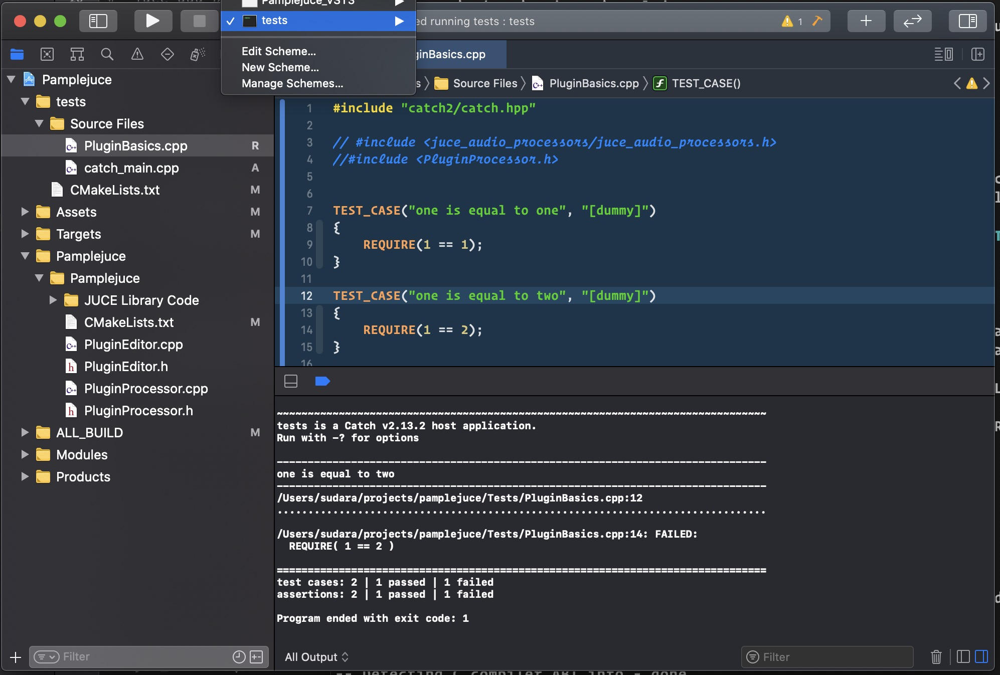

Pamplejuce is a ~~template~~ lifestyle for creating JUCE plugins with 2020 best practices.

Out of the box, it supports:

1. C++20
2. JUCE 6.x as a submodule, tracking develop
3. CMake 3.18
4. Catch2 2.13.2
5. Github Actions for both CI and artifact building
6. Proper .gitignore given the above

## What it doesn't handle (yet)

1. MacOS code signing, packaging, notarization.

## How to setup the repo for YOUR project

This is a template repo! Yeah, I didn't know GitHub had these either, but basically you can kickstart a new repo using this one as the base by clicking the "Use this template" button an the top of the page.

After you have a copy, be sure to:

1. [Download CMAKE](https://cmake.org/download/)

2. Replace `Pamplejuce` with the name of your project in CMakeLists.txt

3. Get the latest JUCE via `git submodule update --init`. By default this will track JUCE's develop branch.

4. Set the correct flags for your plugin under `juce_add_plugin`. Check out the API https://github.com/juce-framework/JUCE/blob/master/docs/CMake%20API.md and be sure to change things like `PLUGIN_CODE` and `PLUGIN_MANUFACTURER_CODE`


## Conventions

1. Your tests will be in "Tests"
2. Your binary data target is called "Assets"

## Tips n' Tricks

### Always manually add new Source/Test files to CMakeLists.txt

One might think that in 2020, files added to your Sources directory would automatically added to a target.

It's true, you could use globbing technically. But ["Modern CMake" distinctly prohibits this](https://gist.github.com/mbinna/c61dbb39bca0e4fb7d1f73b0d66a4fd1#dont-use-fileglob-in-projects) — why? Because CMake has no way of knowing you've added a new file, so it won't be picked up.

## How does this all work at a high level?

The `CMakeLists.txt` file describes how to configure and build the plugins as well as setup the IDE project. 

As these myriad concerns are not clearly separated in the config, nor in the CLI tools nor in the CLI tool options — there's a reason CMake has the reputation it has.

JUCE provides cmake helpers, allowing plugin devs to call a small number of functions like `juce_add_plugin`. It sets up our project much like JUCE's Projucer did in the past, generating the IDE project and setting up all the build config files.

GitHub Actions is running CMake on MacOS, Windows and Linux, therefore configuring, building and testing for each environment.

CMake as a build tool is very flexible and does its various jobs for us in multiple incantations:

### 1. Configure

The `CMakeLists.txt` is parsed, processed and the project is configued.

This might look something like `cmake -B Builds`

The `-B` option tells CMake what folder to perform the build in, where to stick all the resultant files, etc. 


### 2. Generate

This outputs files for system specific build tooling and IDEs to read.

Generate a VS 2019 Project file:
```
cmake -B Builds -G "Visual Studio 16 2019"
```


Or an Xcode project:
```
cmake -B Builds -G Xcode
```

During local JUCE development, we'd run one of the above and then trigger actual builds from our IDE rather than CMake.

### 3. Build

You can skip the IDE project generation but still build using the system specific build tools (such as Xcode) on the command line with: 

```
cmake --build Builds --config Release
```

This is how GitHub Actions builds.

### 4. Test

Again, things are messy and lines are blurred.

CTest is just a unit test runner. It doesn't know anything about unit test implementation or know anything about [the executable that it will run](https://bertvandenbroucke.netlify.app/2019/12/12/unit-testing-with-ctest/). 

So a test executable has to be created by CMake first, which we are doing with the help of the [Catch2 CMake integration](https://github.com/catchorg/Catch2/blob/devel/docs/cmake-integration.md).

Testing is enabled with `enable_testing()` in a `CMakeLists.txt` file and then the `ctest` command can be run **in the *Builds* directory**


When run, ctest will barfs up logs in Testing/Temporary. Thanks, ctest. 

Since tests are an executable target, they are built and run via Xcode schemes, with results showing up in the console:



### 5. Package

TBD.

## How do variables work in GitHub Actions?

It's very confusing, as the documentation is a big framented.

1. Things in double curly braces like `${{ matrix.artifact }}` are called ["contexts or expressions"](https://docs.github.com/en/free-pro-team@latest/actions/reference/context-and-expression-syntax-for-github-actions) and can be used to get, set, or perform simple operations.
2. In "if" conditions you can omit the double curly braces, as the whole condition is evaluated as an expression: `if: contains(github.ref, 'tags/v')`
3. You can set variables for the whole workflow to use in ["env"](https://docs.github.com/en/free-pro-team@latest/actions/reference/workflow-syntax-for-github-actions#env)
4. Reading those variables is done with the [env context](https://docs.github.com/en/free-pro-team@latest/actions/reference/context-and-expression-syntax-for-github-actions#env-context) when you are inside a `with`, `name`, or `if`: `${{ env.SOME_VARIABLE }}`
5. Inside of `run`, you have access to bash ENV variables *in addition* to contexts/expressions. That means `$SOME_VARIABLE` or `${SOME_VARIABLE}` will work but *only when using bash* and [not while using powershell on windows](https://docs.github.com/en/free-pro-team@latest/actions/reference/workflow-syntax-for-github-actions#using-a-specific-shell). The version with curly braces (variable expansion) is often used [when the variable is forming part of a larger string to avoid ambiguity](https://stackoverflow.com/questions/8748831/when-do-we-need-curly-braces-around-shell-variables). Be sure that the ENV variable was set properly in the workflow/job/step before you use it. And if you need the variable to be os-agnostic, use the env context.

## References & Inspiration

### CMake

* [The "Modern CMake" gitbook](https://cliutils.gitlab.io/) which also has a section on [https://cliutils.gitlab.io/modern-cmake/chapters/testing/catch.html](Catch2).
* [Effective Modern CMake](https://gist.github.com/mbinna/c61dbb39bca0e4fb7d1f73b0d66a4fd1)
 JUCE's announcment of [native CMake support](https://forum.juce.com/t/native-built-in-cmake-support-in-juce/38700)
* [Eyalamir Music's JUCE / CMake prototype repository](https://github.com/eyalamirmusic/JUCECmakeRepoPrototype)

### GitHub Actions

* [Christian Adam's HelloWorld CMake and ccache repo](https://github.com/cristianadam/HelloWorld)
* [Maxwell Pollack's JUCE CMake + GitHub Actions repo](https://github.com/maxwellpollack/juce-plugin-ci)

### Catch2 & CTest

* [Catch2's docs on CMake integration](https://github.com/catchorg/Catch2/blob/devel/docs/cmake-integration.md)
* [Roman Golyshev's Github Actions & Catch2 repo](https://github.com/fedochet/github-actions-cpp-test)
* [Matt Clarkson's CMakeCatch2 repo](https://github.com/MattClarkson/CMakeCatch2)
* [CMake Cookbook example](https://github.com/dev-cafe/cmake-cookbook/tree/master/chapter-04/recipe-02/cxx-example)
* [Unit Testing With CTest](https://bertvandenbroucke.netlify.app/2019/12/12/unit-testing-with-ctest/)

### Packaging 

* [iPlug Packages and Inno Setup scripts](https://github.com/olilarkin/wdl-ol/tree/master/IPlugExamples/IPlugEffect/installer)
* [Surge's pkgbuild installer script](https://github.com/kurasu/surge/blob/master/installer_mac/make_installer.sh)
* [Chris Randall's PackageBuilder script](https://forum.juce.com/t/vst-installer/16654/15)

## Pamplejuce dev

I've been blowing away the Builds directory when altering the CMake.

```
rm -rf Builds && cmake -B Builds -G Xcode
rm -rf Builds && cmake -B Builds && cmake --build Builds --config Release 
```

### Updating 

1. Update with latest CMake version.
2. Update JUCE with `git submodule update --remote --merge`